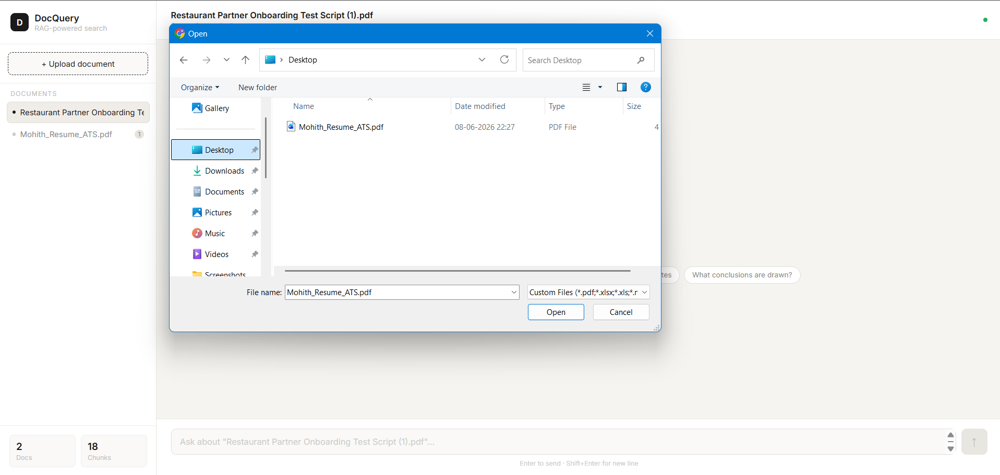
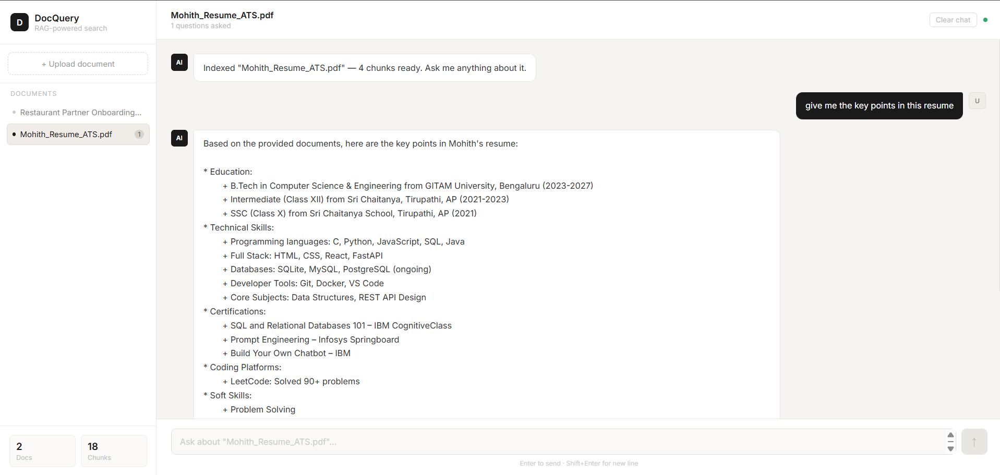

# DocQuery — RAG-Powered Document Chatbot

> Upload your documents. Ask anything. Get grounded, cited answers — no hallucination.


---

## Overview

DocQuery is a private, local-first document chatbot built on a full RAG (Retrieval-Augmented Generation) pipeline. Upload PDFs, Excel spreadsheets, or Markdown files and ask natural language questions about their contents. The system retrieves semantically relevant chunks from your documents and passes them to an LLM — ensuring every answer is grounded in your actual data, with source citations included.

---

### Upload a document


### Ask a question


---

## Features

- **Multi-format ingestion** — Supports PDF, Excel (.xlsx), and Markdown (.md) files
- **Semantic search** — Embeds document chunks using `baai/bge-m3` and stores them in ChromaDB
- **Grounded answers** — LLM answers only from retrieved context; returns a safe fallback when no relevant content is found
- **Source citations** — Every response includes the document it was sourced from
- **Per-document conversations** — Each uploaded document maintains its own chat history
- **Persistent history** — Conversations survive page refreshes via localStorage
- **File upload via UI** — Drag and drop or click to upload directly from the browser
- **Interactive API docs** — Swagger UI available at `/docs` for testing all endpoints

---

## Tech Stack

| Layer | Technology |
|---|---|
| Backend | FastAPI + Uvicorn |
| Document Extraction | PyMuPDF (PDF), Pandas (Excel) |
| Chunking | LangChain `RecursiveCharacterTextSplitter` |
| Embeddings | `baai/bge-m3` via OpenRouter API |
| Vector Database | ChromaDB (persistent local storage) |
| LLM | `meta-llama/llama-3-8b-instruct` via OpenRouter |
| Frontend | React 18 + Vite |

---

## Project Structure

```
rag-chatbot/
├── backend/
│   ├── api/
│   │   ├── main.py            # FastAPI app, routes (/upload, /query, /documents)
│   │   └── llm.py             # LLM call with grounding system prompt
│   ├── ingest/
│   │   ├── extractor.py       # PDF, Excel, Markdown text extraction
│   │   ├── chunker.py         # Text splitting with metadata tagging
│   │   ├── vectorstore.py     # ChromaDB client + OpenRouter embedding function
│   │   └── run_ingest.py      # Manual batch ingestion script
│   ├── retriever/
│   │   └── retriever.py       # Semantic search against ChromaDB
│   ├── auth/
│   │   └── auth.py            # JWT auth utilities (optional)
│   ├── .env                   # Environment variables (not committed)
│   └── requirements.txt
├── frontend/
│   └── src/
│       ├── App.jsx            # Main chat UI with sidebar + conversation history
│       └── main.jsx
├── data/                      # Drop files here for manual ingestion
├── Procfile
└── .gitignore
```

---

## Getting Started

### Prerequisites

- Python 3.11
- Node.js 18+
- OpenRouter API key → [openrouter.ai](https://openrouter.ai)

### 1. Clone the repository

```bash
git clone https://github.com/mohith292005/RagChatbot.git
cd RagChatbot
```

### 2. Set up the backend

```bash
cd backend

# Windows
python -m venv venv
.\venv\Scripts\activate

# Mac/Linux
python -m venv venv
source venv/bin/activate

pip install -r requirements.txt
```

### 3. Configure environment variables

Create a `.env` file inside the `backend/` folder:

```env
OPENROUTER_API_KEY=sk-or-v1-your-key-here
CHROMA_PATH=./chroma_db
LLM_MODEL=meta-llama/llama-3-8b-instruct
SECRET_KEY=your-random-secret
```

### 4. Start the backend

```bash
cd backend
uvicorn api.main:app --port 8000
```

### 5. Set up and start the frontend

```bash
cd frontend
npm install
npm run dev
```

### 6. Open the app

```
http://localhost:5173
```

---

## API Endpoints

| Method | Endpoint | Description |
|---|---|---|
| `POST` | `/upload` | Upload and index a document |
| `POST` | `/query` | Ask a question about indexed documents |
| `GET` | `/documents` | List all indexed document names |
| `GET` | `/health` | Health check + total chunk count |

Interactive API docs → `http://localhost:8000/docs`

---

## How It Works

```
User uploads file
      ↓
Extract text (PyMuPDF / Pandas)
      ↓
Split into chunks (512 tokens, 64 overlap)
      ↓
Embed chunks (baai/bge-m3 via OpenRouter)
      ↓
Store in ChromaDB with metadata
      ↓
User asks a question
      ↓
Embed query → semantic search → top-5 chunks
      ↓
Send chunks + question to LLM with grounding prompt
      ↓
Cited answer returned to UI
```

---

## Anti-Hallucination Design

- LLM is instructed via system prompt to answer **only from retrieved context**
- Returns a safe fallback when no relevant chunks are found
- `temperature=0.1` keeps outputs conservative and factual
- Every answer cites the source document filename
- `chunk_overlap=64` prevents context loss at chunk boundaries

---

## Roadmap

- [x] Multi-document upload via UI
- [x] Per-document conversation history
- [x] Persistent chat via localStorage
- [x] Anti-hallucination with source citations
- [ ] Conversation memory (multi-turn context)
- [ ] Re-ranking for improved retrieval accuracy
- [ ] Delete document from sidebar
- [ ] Streaming responses
- [ ] Deploy on Render + Vercel

---

## Author

**Mohith**
GitHub: [@mohith292005](https://github.com/mohith292005)
